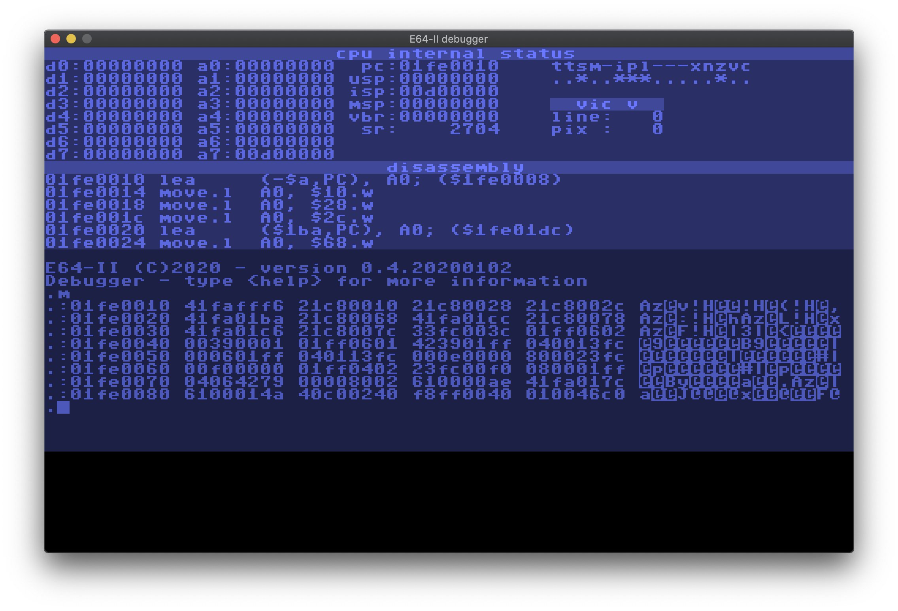

# E64

## Description
The E64 (Enhanced 64) and E64-II are virtual computer systems (under construction) that run on macOS and linux. Heavily inspired by the Commodore 64 and other (more advanced) personal computer systems of the era.

Technical specifications (not yet complete and a work in progress):
### E64
* CSG 65CE02 CPU (mostly 8 bit and some 16 bit instructions) running at 4.096MHz using the [lib65ce02](https://github.com/elmerucr/lib65ce02) library.
* A total of 16MB ram connected to a Texas Instruments SN74LS612 Memory Management Unit.
* A custom Video Interface Chip with a resolution of 512x320 pixels (512x256 excluding  top and bottom borders).
* Two SID chips (MOS 6581) with stereo mixing possibilities. Each individual SID chip runs at 985248Hz (C64 pal) for correct pitch. Emulation is achieved with the excellent [resid](http://www.zimmers.net/anonftp/pub/cbm/crossplatform/emulators/resid/index.html) library.
* Four independent and programmable timers with interrupt functionality.
### E64-II
* Motorola 68020 CPU running at 8.192MHz using the [Musashi](https://github.com/kstenerud/Musashi) library.
* A total of 16MB ram.
* Two SID chips (like E64), but several registers (lo/hi from frequency, pulse width and filters) have been swapped to facilitate use with the big endian M68020.
## Motivation
todo
## Screenshots
E64 running in normal mode:

E64 debugger:

E64-II debugger:

## Compiling
### Core application
#### macOS
* Install [Xcode](https://developer.apple.com/xcode)
* Install the [SDL2 framework](https://www.libsdl.org/download-2.0.php) development library to /Library/Frameworks
* Open the Xcode project in the ./macOS/E64 folder and build
#### Ubuntu Linux and derivatives
Run the following commands in a terminal:

````console
$ sudo apt install build-essential cmake git libsdl2-dev
$ git clone https://github.com/elmerucr/E64
$ cd E64 && mkdir build && cd build
$ cmake ..
$ make
````

Finally, to run the application from the build directory:

````console
$ ./E64
````
### Assembling the kernel ROM
Make sure to have ````64tass```` installed on your system and working from the command line.

In the ````./src/devices/roms/kernel/```` directory, a ````Makefile```` can be found that makes use of ````64tass```` to assemble the ````*.asm```` sourcefiles into a binary rom image. Furthermore, a small ````bin2hex```` utility will be built that converts this image into a c++ sourcefile (````kernel.cpp````) that's part of the larger E64 project.
## Other websites and projects of interest
* [64tass](https://sourceforge.net/projects/tass64/) - An assembler for the legendary 6502 processor and its derivatives
* [asmx multi-CPU assembler](http://xi6.com/projects/asmx/) - Excellent assembler with Motorola 680x0 support amongst others
* [C256 Foenix](https://c256foenix.com) - A computer that could have possibly followed the Commodore 128 if things would have been different at Commodore at the time
* [Hatari](https://hatari.tuxfamily.org) - Hatari is an Atari ST/STE/TT/Falcon emulator
* [lib65ce02](https://github.com/elmerucr/lib65ce02) - CSG65CE02 emulator written in C
* [Mega65](http://mega65.org) - The 21st century realization of the C65 heritage
* [Musashi](https://github.com/kstenerud/Musashi) - Motorola 680x0 emulator written in C
* [SDL Simple DirectMedia Layer](https://www.libsdl.org) - A cross-platform development library designed to provide low level access to audio, keyboard, mouse, joystick, and graphics hardware
* [ultimate64](https://ultimate64.com/Ultimate-64) - A hardware implementation (FPGA) of the C64
* [vAmiga](http://www.dirkwhoffmann.de/software/vAmiga.html) - An Amiga 500, 1000, or 2000 on your Apple Macintosh
* [vasm](http://sun.hasenbraten.de/vasm/) - A portable and retargetable assembler with very good support for the Motorola 680x0 family (including M6888x, M68851 and CPU32)
* [VICE](http://vice-emu.sourceforge.net) - The Versatile Commodore Emulator
* [VirtualC64](http://www.dirkwhoffmann.de/software/virtualC64.html) - A Commodore 64 on your Apple Macintosh
* [visual6502](http://www.visual6502.org) - Visual Transistor-level Simulation of the 6502 CPU and other chips
## MIT License
Copyright (c) 2019 elmerucr

Permission is hereby granted, free of charge, to any person obtaining a copy of this software and associated documentation files (the "Software"), to deal in the Software without restriction, including without limitation the rights to use, copy, modify, merge, publish, distribute, sublicense, and/or sell copies of the Software, and to permit persons to whom the Software is furnished to do so, subject to the following conditions:

The above copyright notice and this permission notice shall be included in all copies or substantial portions of the Software.

THE SOFTWARE IS PROVIDED "AS IS", WITHOUT WARRANTY OF ANY KIND, EXPRESS OR IMPLIED, INCLUDING BUT NOT LIMITED TO THE WARRANTIES OF MERCHANTABILITY, FITNESS FOR A PARTICULAR PURPOSE AND NONINFRINGEMENT. IN NO EVENT SHALL THE AUTHORS OR COPYRIGHT HOLDERS BE LIABLE FOR ANY CLAIM, DAMAGES OR OTHER LIABILITY, WHETHER IN AN ACTION OF CONTRACT, TORT OR OTHERWISE, ARISING FROM, OUT OF OR IN CONNECTION WITH THE SOFTWARE OR THE USE OR OTHER DEALINGS IN THE
SOFTWARE.
