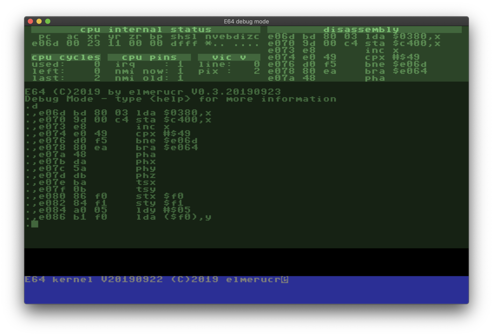

# E64

## Description
The E64 (Enhanced 64) is a virtual computer system (under construction) that runs on macOS and linux. It's heavily inspired by the Commodore 64 and other (more advanced) personal computer systems of the era.

Technical specifications (not yet complete and work in progress):
* CSG 65CE02 CPU (mostly 8 bit and some 16 bit instructions) running at 4.096MHz using the [lib65ce02](https://github.com/elmerucr/lib65ce02) library.
* A total of 16MB of ram in combination with a Texas Instruments SN74LS612 Memory Management Unit.
* A custom Video Interface Chip with a resolution of 512x320 pixels (512x256 excluding  top and bottom borders).
* Up to four SID chips (MOS 6581) with stereo mixing possibilities. Each individual SID chip runs at 985248Hz (C64 pal) for identical pitch. Emulation is achieved with the excellent [resid](http://www.zimmers.net/anonftp/pub/cbm/crossplatform/emulators/resid/index.html) library.
## Motivation
todo
## Screenshots
Running in normal mode:

In debug mode:

## Compiling
### Core application
#### macOS
* Install [Xcode](https://developer.apple.com/xcode)
* Install the [SDL2 framework](https://www.libsdl.org/download-2.0.php) development library to /Library/Frameworks
* Open the Xcode project in the ./macOS/E64 folder and build
#### Ubuntu Linux and derivatives
Run the following commands in a terminal:

````console
$ sudo apt install build-essential cmake git libsdl2-dev
$ git clone https://github.com/elmerucr/E64
$ cd E64 && mkdir build && cd build
$ cmake ..
$ make
````

Finally, to run the application from the build directory:

````console
$ ./E64
````
### Assembling the kernel ROM
Make sure to have ````64tass```` installed on your system and working from the command line.

In the ````./src/devices/roms/kernel/```` directory, a ````Makefile```` can be found that makes use of ````64tass```` to assemble the ````*.asm```` sourcefiles into a binary rom image. Furthermore, a small ````bin2hex```` utility will be built that converts this image into a c++ sourcefile (````kernel.cpp````).
## MIT License
Copyright (c) 2019 elmerucr

Permission is hereby granted, free of charge, to any person obtaining a copy of this software and associated documentation files (the "Software"), to deal in the Software without restriction, including without limitation the rights to use, copy, modify, merge, publish, distribute, sublicense, and/or sell copies of the Software, and to permit persons to whom the Software is furnished to do so, subject to the following conditions:

The above copyright notice and this permission notice shall be included in all copies or substantial portions of the Software.

THE SOFTWARE IS PROVIDED "AS IS", WITHOUT WARRANTY OF ANY KIND, EXPRESS OR IMPLIED, INCLUDING BUT NOT LIMITED TO THE WARRANTIES OF MERCHANTABILITY, FITNESS FOR A PARTICULAR PURPOSE AND NONINFRINGEMENT. IN NO EVENT SHALL THE AUTHORS OR COPYRIGHT HOLDERS BE LIABLE FOR ANY CLAIM, DAMAGES OR OTHER LIABILITY, WHETHER IN AN ACTION OF CONTRACT, TORT OR OTHERWISE, ARISING FROM, OUT OF OR IN CONNECTION WITH THE SOFTWARE OR THE USE OR OTHER DEALINGS IN THE
SOFTWARE.